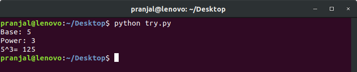

# Practice Questions
## Python Pre-requisite
<table width="100%"> 
  <tr>
  <td width="25%">
    - [If-else](https://www.learnbyexample.org/python-if-else-elif-statement/)
    - [Loop](https://www.learnbyexample.org/python-while-loop/)
    - [break](https://www.learnbyexample.org/python-break-statement/)

    - [Functions](https://www.learnbyexample.org/python-functions/)
    - [Class](https://www.learnbyexample.org/python-classes-and-objects/)
    - [Exception Handling](https://www.learnbyexample.org/python-exceptions-try-except/)

  </td>

  <td width="25%">
  - [Dictionary](https://www.learnbyexample.org/python-dictionary/)
  - [Lists](https://www.learnbyexample.org/python-list/) 

  - [Format String](https://www.learnbyexample.org/python-string-format-method/)
  - [Operators](https://www.learnbyexample.org/python-operators/)
  </td>
  </table>

### Ques-1
Write a function to compute 1/0 and use try/except to catch the exception.
- Output \

### Ques-2
Write a function to generate a Dictionary where `KEY` are from number 1 to 10 (both inclusive) and `VALUE` consists cube of these numbers. \
And print the `KEY` whose `VALUE` is divisible by both 2 and 5.
- Output \

### Ques-3
Write a function to find smallest 'x' digit number that is divisible by 'y'
- Output \

### Ques-4
Write a function to calculate Right and Left wheel velocity for unicycle differential drive robot
and feed these velocity to another function that will print the movement of the robot.
- Output \

### Ques-5 (optional)
Write a function to calculate power of a number without using `math.pow()` and `**` operator
- Output \

### Challenge Question
A two wheeled non-holonomic robot can move only in 4 directions in XY plane - UP, DOWN, LEFT, RIGHT. \
Write a function to calculate Euclidean distance between final position & initial position (0, 0) and angle w.r.t. `-x` axis. \
Output should be rounded-off to greatest integer number
- Output

